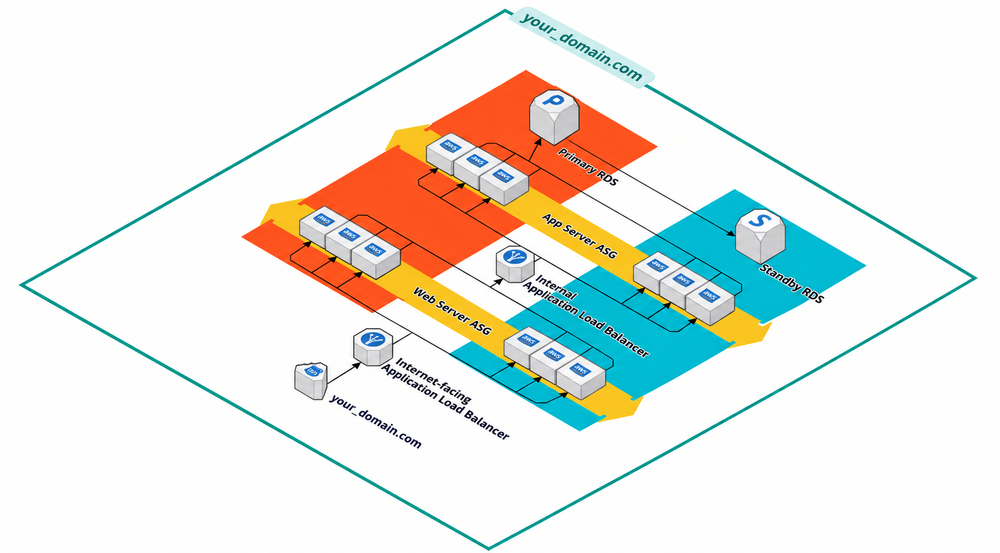

# Library Management System

A role-based library management application built with Flask, SQLAlchemy, MySQL, and a responsive HTML/CSS/JavaScript frontend.

[](https://www.python.org/)
[](https://flask.palletsprojects.com/)
[](https://www.mysql.com/)
[](#license)

> A clean, practical library workspace for administrators, librarians, and borrowers.

## Contents

- [What it does](#what-it-does)
- [Architecture](#architecture)
- [Project layout](#project-layout)
- [Run locally](#run-locally)
- [Demo accounts](#demo-accounts)
- [Configuration](#configuration)
- [Database](#database)
- [AWS deployment](#aws-deployment)
- [Security checklist](#security-checklist)
- [License](#license)

## What it does

### Admin

- Manage users and account status
- Manage books and authors
- Review borrowing activity
- Track the complete library catalogue

### Librarian

- Search the catalogue
- Add and update books
- Register authors
- Issue and return books
- Monitor active loans

### Borrower

- Browse and search available books
- Borrow books
- View personal borrowing history
- Return to the role-specific portal after login

## Architecture

The application can run locally with SQLite, or in production as the AWS three-tier deployment shown below.



The production traffic flow is:

```text
Your domain
    |
    v
Internet-facing Application Load Balancer
    |
    v
Web Server Auto Scaling Group
    |
    v
Internal Application Load Balancer
    |
    v
App Server Auto Scaling Group
    |
    v
Amazon RDS: Primary Database -> Standby Database
```

The web and app tiers run across multiple Availability Zones for resilience. The public load balancer accepts domain traffic, the web tier forwards application requests to the internal load balancer, and only the private app tier connects to RDS. The database layer is not public.

## Project layout

```text
.
├── app.py                    # Flask application and API routes
├── seed_data.py              # Repeatable demo-data seeder
├── schema.sql                # MySQL schema
├── requirements.txt          # Python dependencies
├── Procfile                  # Gunicorn production command
├── 3-tier.png                # AWS production architecture diagram
├── AWS_DEPLOYMENT_GUIDE.md   # Detailed AWS walkthrough
├── Websever/                 # Frontend pages and browser scripts
│   ├── index.html
│   ├── login.html
│   ├── admin.html
│   ├── librarian.html
│   ├── borrower.html
│   ├── css/style.css
│   └── js/
└── static/                   # Flask static assets
```

## Run locally

### 1. Create and activate a virtual environment

PowerShell:

```powershell
python -m venv .venv
.\.venv\Scripts\Activate.ps1
```

macOS/Linux:

```bash
python3 -m venv .venv
source .venv/bin/activate
```

### 2. Install dependencies

```bash
python -m pip install -r requirements.txt
```

### 3. Configure the application

For the quickest local start, no database variables are required. The app falls back to `sqlite:///library.db`.

To use MySQL or Amazon RDS, create a `.env` file in the project root:

```env
SECRET_KEY=replace-with-a-long-random-value
DB_HOST=your-rds-endpoint.amazonaws.com
DB_PORT=3306
DB_NAME=library_management
DB_USER=admin
DB_PASSWORD=replace-with-your-password
```

`DB_HOST` must be the RDS endpoint DNS name, not an ARN. Never commit `.env` or real credentials.

### 4. Seed demo data

```bash
python seed_data.py
```

The seeder is safe to run repeatedly. It creates missing users, books, authors, and sample borrowing records without duplicating existing records.

### 5. Start the application

```bash
python app.py
```

Open [http://127.0.0.1:5000](http://127.0.0.1:5000). The default development server listens on `0.0.0.0:5000`, which also matches the production load-balancer target port.

For a production-style local run:

```bash
gunicorn --bind 0.0.0.0:5000 app:app
```

## Demo accounts

| Role | Email | Password |
| --- | --- | --- |
| Admin | `admin@library.local` | `admin123` |
| Librarian | `librarian@library.local` | `librarian123` |
| Borrower | `borrower@library.local` | `borrower123` |

These credentials are for local demonstration only. Change or remove them before production use.

## Configuration

| Variable | Purpose | Default |
| --- | --- | --- |
| `SECRET_KEY` | Flask session signing key | `dev-only-change-me` |
| `DATABASE_URL` | Alternative SQLAlchemy connection string | SQLite database |
| `DB_HOST` | MySQL/RDS endpoint | Not set |
| `DB_PORT` | MySQL port | `3306` |
| `DB_NAME` | Database name | `library_management` |
| `DB_USER` | Database user | Empty |
| `DB_PASSWORD` | Database password | Empty |
| `HOST` | Bind address | `0.0.0.0` |
| `PORT` | Application port | `5000` |
| `FLASK_DEBUG` | Enable Flask debug mode | `0` |
| `WEB_ORIGIN` | Optional allowed frontend origin | Not set |
| `SESSION_COOKIE_SECURE` | Send cookies only over HTTPS | `0` |

## Database

For a fresh MySQL database, create the schema with:

```bash
mysql -h YOUR_RDS_ENDPOINT -P 3306 -u admin -p library_management < schema.sql
```

Then seed it:

```bash
python seed_data.py
```

The schema contains users, authors, books, and borrowings with foreign keys, indexes, role values, borrowing status values, and copy-count constraints.

## AWS deployment

The recommended production layout uses:

- One VPC with two public and four private subnets across two Availability Zones
- Two NAT Gateways and one Internet Gateway
- An internet-facing Application Load Balancer for public traffic
- Nginx web servers in public subnets
- An internal Application Load Balancer on port `5000`
- Gunicorn/Flask app servers in private subnets
- Private Amazon RDS for MySQL
- Route 53 and AWS Certificate Manager for DNS and HTTPS
- Separate Auto Scaling Groups for the web and app tiers

### Security-group flow

| Security group | Inbound traffic |
| --- | --- |
| Internet ALB | TCP `80` and `443` from the Internet |
| Web server | TCP `80` from the Internet ALB security group |
| Internal ALB | TCP `5000` from the web-server security group |
| App server | TCP `5000` from the internal-ALB security group |
| Database | TCP `3306` from the app-server security group |

Use security-group references instead of broad CIDR ranges wherever possible. The app server and database must not have public IP addresses.

### Deployment sequence

1. Create the VPC, subnets, route tables, NAT Gateways, and Internet Gateway.
2. Create the five security groups using the traffic matrix above.
3. Create a private RDS subnet group in two Availability Zones.
4. Launch the web tier and install/configure Nginx.
5. Launch the app tier in private subnets and copy the project files.
6. Create `.env`, install dependencies, and run `python seed_data.py`.
7. Run Gunicorn on `0.0.0.0:5000` using the command in `Procfile`.
8. Create the internal ALB and target group with a port `5000` health check.
9. Configure Nginx to proxy `/api/` to the internal ALB.
10. Create the internet-facing ALB and forward HTTP/HTTPS to the web tier.
11. Add the Route 53 alias record and attach an ACM certificate.
12. Create launch templates and Auto Scaling Groups for both tiers.

For the full AWS console walkthrough, see [AWS_DEPLOYMENT_GUIDE.md](AWS_DEPLOYMENT_GUIDE.md).

## Security checklist

Before production:

- Replace the development `SECRET_KEY`.
- Use HTTPS and set `SESSION_COOKIE_SECURE=1`.
- Store credentials in AWS Secrets Manager or SSM Parameter Store.
- Keep RDS private and disable public accessibility.
- Restrict security groups to the immediately preceding tier.
- Remove or change all demo credentials.
- Run Gunicorn behind Nginx; do not expose Flask’s development server publicly.
- Enable backups, monitoring, and CloudWatch alarms.
- Rotate database credentials and SSH keys regularly.

## License

This project is intended for educational and demonstration use. Add the license terms for your deployment or organization before publishing it publicly.
